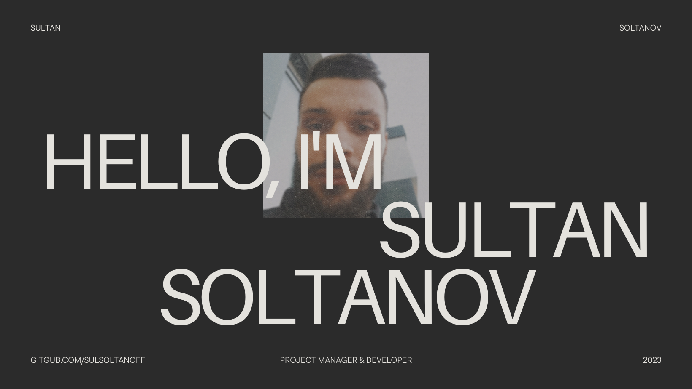

<!-- <h1>Hello! I'm Sultan 👋</h1> -->
# 

<h3>  About Me </h3>

- 🔭 &nbsp; As a technology-savvy person, I strive to stay at the forefront of the IT industry. I am constantly learning about new and developing technologies and try to keep up with the latest trends and developments in the field.
- 💼 &nbsp; Currently working as an expert in technical support. As a technical support specialist, I am responsible for providing technical assistance and support to customers who encounter problems related to hardware, software or other technological products.
- 🌱 &nbsp; In my spare time I am developing the Open Source project. I believe in the power of open-source technology to drive innovation, and I am proud to be a part of this movement.
- 🎨 &nbsp; I like watching Tarantino westerns and sometimes anime.
- 🚀 &nbsp; Only hard work and the desire to ride the luck, will bring you success. Good luck and thanks for visiting my page!
  
## :octocat: Github Stats

<!--   
   -->
  
  
  
  
<!--    -->

### 🌐 Social media

<h3> ⚡ Favorite languages and tools </h3>

<h3>Achievements</h3>

---

