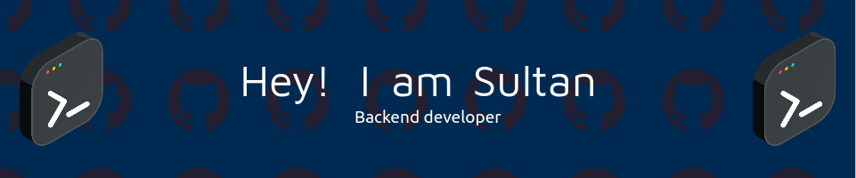

<!-- <h1>Hello! I'm Sultan 👋</h1> -->
# 

<h3>  About Me </h3>

- 🔭 &nbsp; I'm constantly learning and developing new technologies and principles of team management.
- 💼 &nbsp; Currently working as an expert in technical support.
- 🌱 &nbsp; In my spare time I am developing the Open Source project.
- 🎨 &nbsp; I like watching Tarantino westerns and sometimes anime.
- 🚀 &nbsp; Only hard work and the desire to ride the luck, will bring you success. Good luck and thanks for visiting my page!
  
## :octocat: Github Stats

  
  
  

### 🌐 Social media

<h3> ⚡ Favorite languages and tools </h3>

	<code></code>
	<code></code>
	<code></code>
	<code></code>
	<code></code>
	<code></code>
	<code></code>
	<code></code>
	<code></code>
	<code></code>
	<code></code>
	<code></code>
	<code></code>
	<code></code>
	<code></code>
	<code></code>
	<code></code>
	<code></code>
	<code></code>
	<code></code>
	<code></code>
	<code></code>
	<code></code>
	<code></code>
	<code></code>
	<code></code>
	<code></code>
	<code></code>
	<code></code>
	<code></code>
	<code></code>
	<code></code>
	<code></code>
	<code></code>
	<code></code>

