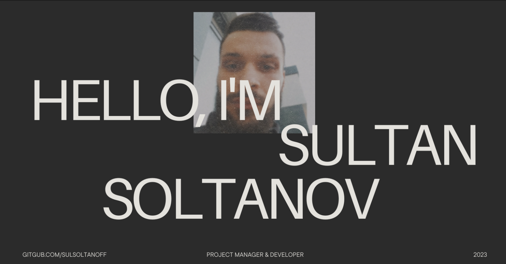

<!-- <h1>Hello! I'm Sultan 👋</h1> -->
# 

<h3>  About Me </h3>

💡 Tech-Savvy Trailblazer | 💼 Customer Loyalty Expert | 🌱 Open Source Enthusiast | 🎬 Cinema Connoisseur | 🚀 Ambitious Dreamer
- 🌟 Welcome to my Github profile! 🌟

- 🔭 With an unyielding passion for technology, I relentlessly pursue the forefront of the ever-evolving IT industry. I am a constant learner, immersing myself in the realm of new and emerging technologies, and staying ahead of the curve by keeping up with the latest trends and advancements.

- 💼 Currently, I thrive as an expert in maintaining customer loyalty within a prominent B2B IT company. In this role, I adeptly navigate conflict and ambiguity, delivering quality and transparency to customers who entrust us with their services. As a practiced project manager, I meticulously organize my work and foster effective communication to ensure the seamless delivery of results for both myself and my team.

- 🌱 Beyond the confines of my professional realm, my free time is dedicated to nurturing various Open Source projects. I wholeheartedly believe in the transformative power of open-source technology, and I take immense pride in being an active contributor to the movement that fuels innovation and collaboration.

- 🎨 When I seek a moment of cinematic delight, you can find me captivated by Tarantino's iconic Westerns and occasionally indulging in the captivating worlds of anime. The intersection of art and technology ignites my imagination, inspiring me to push the boundaries of what is possible.

- 🚀 I firmly believe that success is born from the fusion of unwavering determination and the willingness to seize fortunate opportunities. With sheer dedication and a drive to excel, I embark on a journey to scale new heights and carve my own path to success.

✨ Thank you for visiting my page! Wishing you the best of luck in your own endeavors. Let's embrace the ever-changing world of technology together and create a future where innovation knows no bounds. ✨
  
## :octocat: Github Stats

<!--   
   -->
<!--    -->
  
  
<!--    -->
<!--    -->

### 🌐 Social media

<h3> ⚡ Favorite languages and tools </h3>

<h3>Achievements</h3>

---

